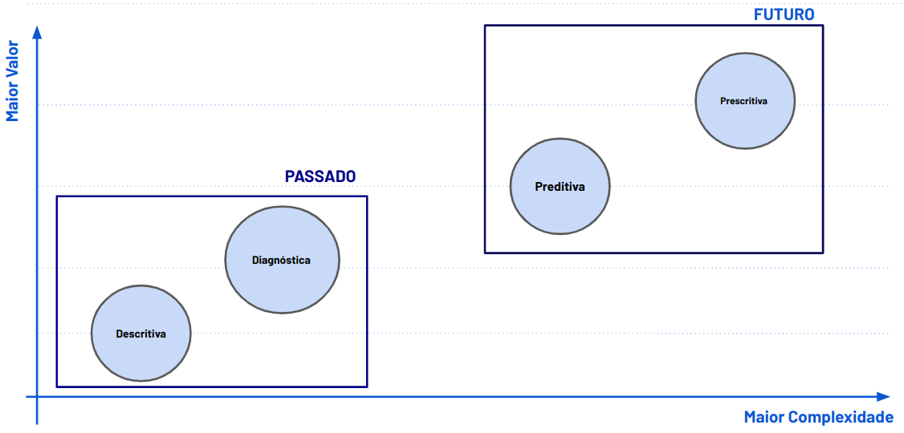

A análise de dados é o processo de inspecionar, limpar, transformar e modelar dados para descobrir informações valiosas, obter insights e tomar decisões informadas. É uma disciplina fundamental no campo da ciência de dados e tem aplicações em diversas áreas, desde negócios e marketing até ciências sociais e pesquisas científicas. É importante lembrar que os conceitos desta disciplina podem ir além da Ciência de Dados

## Tipos de visualização de dados

Existem diferentes tipos de análise de dados que podem ser aplicados, dependendo dos objetivos e da natureza dos dados. Alguns dos tipos mais comuns de análise de dados incluem:

É importante observar que além das diferentes categorias outro parâmetro é a referência temporal. Isto é, a análise diagnóstica e descritivas são puramente baseadas nos dados apenas do passando, enquanto as preditiva e prescritiva conseguem de alguma forma a partir do uso de modelos de IA "prever o futuro". 

