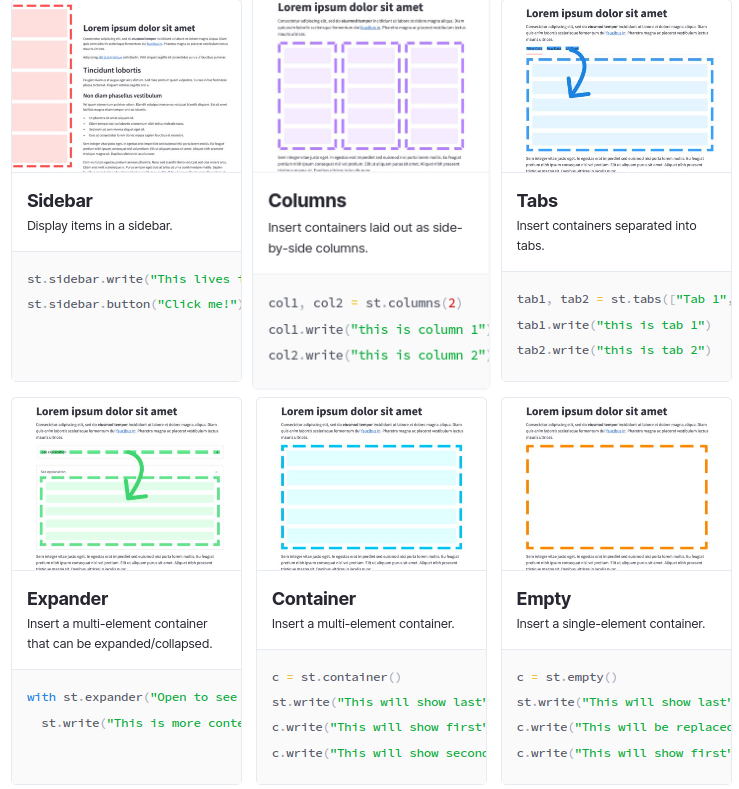
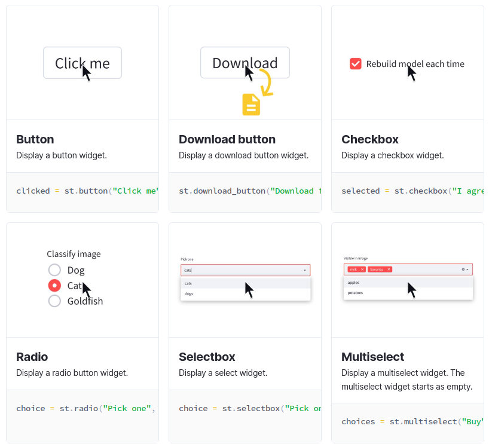

# Streamlit

O Streamlit é uma maneira mais rápida de criar e compartilhar aplicativos de dados, definido assim por muitos desenvolvedores. Dessa forma, com o Streamli torna-se possível transformar scripts Python em aplicativos web interativos com apenas algumas linhas de código. Ele oferece uma interface fácil de usar, na qual é possível adicionar elementos interativos, como botões, caixas de seleção, gráficos e tabelas, tornando a experiência do usuário mais envolvente. Diferente de outros frameworks, o Streamlit não exige nenhum conhecimento de HTML/CSS. 

**Assim como o Dash, recomendo o uso do Streamlit em maquina local com uso de virtualenv**. 

O Streamlit pode ser instalado em um ambiente a partir do comando:

```bash
pip install streamlit
```

Mais detalhes do passo a passo para instalacao podem ser encontrados na [documentação](https://docs.streamlit.io/library/get-started/installation)

## Conceitos Básicos

Para rodar um app Streamlit, use o comando `streamlit run app.py `. Onde o arquivo **app.py** seria o Dashboard. 

O fluxo do desenvolvimento de um Dashboard, em particular usando o Streamlit, pode seguir as seguintes etapas:

1. Defina a fonte (origem) dos seus dados (separar arquivo `.CSV`).
2. Defina o layout do Dashboard.
3. Defina os Gráficos iterativos em Notebook separado.
4. Defina os elementos do usuario (Widgets).
5. Estruture seu App Streamlit.

## Estrutura de um App



O Streamlit fornece várias opções para controlar como os diferentes elementos são dispostos na tela. Na [Documentação - Widgets](https://docs.streamlit.io/library/api-reference/layout) temos a disposição as diferentes formas de construir/organizar os apps.

A estrutura do app segue o forma como sera apresentada para o usuario, considerando os widgets e imagens.

## Input Widgets



Com os Widgets, o Streamlit permite inserir diretamente em seus aplicativos botões, controles deslizantes, entradas de texto e muito mais.

Confira a sitaxe e os diferentes Widgets na [Documentação - Widgets](https://docs.streamlit.io/library/api-reference/widgets).

## Gráficos 

Seguindo a Documentação do Streamlit, a [API Reference - Charts](https://docs.streamlit.io/library/api-reference/charts) apresenta as diferentas ferramentas para inserção de imagens nos dashboards com Streamlit.

### Plotly

Considerando as imagens interativas, este [link](https://docs.streamlit.io/library/api-reference/charts/st.plotly_chart) apresenta o comando `st.plotly_chart`. 

## Templates

Confira o link do [Github](https://github.com/eron93br/aed-python-data-dash/tree/main/streamlit/templates) os os templates.

### Referência e tutoriais

- [Documentação Streamlit](https://docs.streamlit.io/)
- [Streamlit App Gallery](https://docs.streamlit.io/)
- [Streamlit Template Project - Deploy functionality](https://github.com/Franky1/Streamlit-Template)
- [Best Open-source projects with Streamlit](https://github.com/jrieke/best-of-streamlit) 
- [Streamlit templates and awesome projects](https://github.com/MarcSkovMadsen/awesome-streamlit)
- [Getting Started with Streamlit for Data Science](https://github.com/PacktPublishing/Getting-started-with-Streamlit-for-Data-Science)
